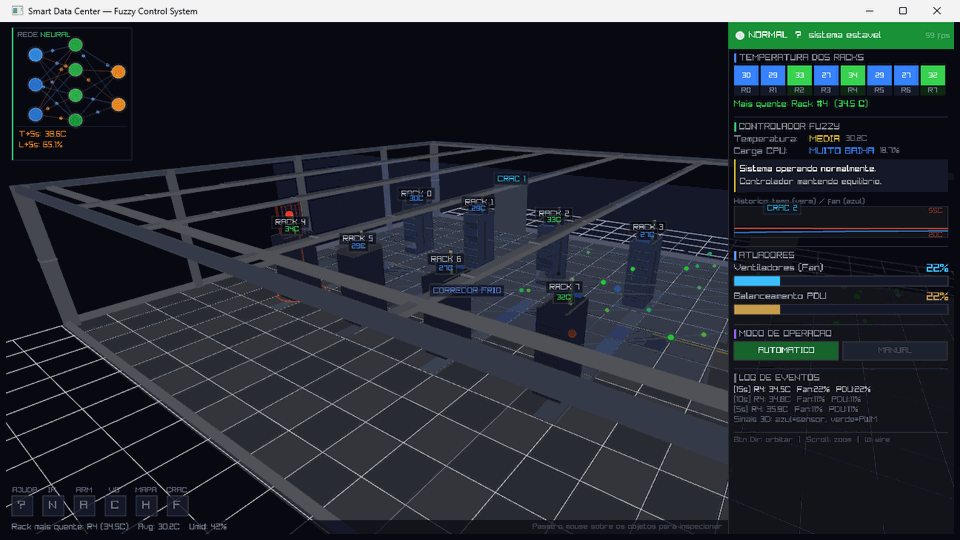
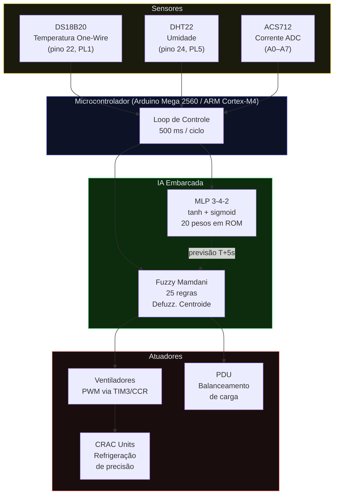
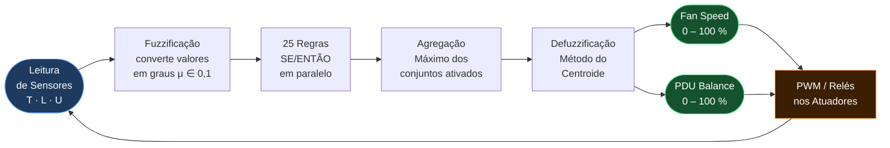
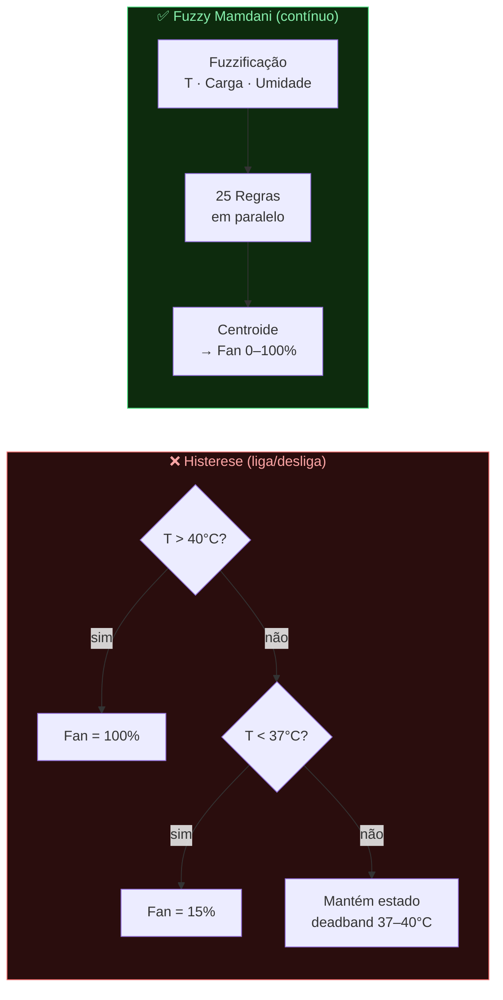

<div align="center">

# Smart Data Center Simulator

**Simulador 3D de data center com controle inteligente de temperatura**

[](https://en.wikipedia.org/wiki/C17_(C_standard_revision))
[](https://www.raylib.com/)
[](https://cmake.org/)
[](https://github.com/microsoft/terminal)
[](LICENSE)

*Lógica Fuzzy Mamdani · Rede Neural MLP · Arduino AVR vs ARM Cortex-M4*

</div>

---

> **Contexto acadêmico:** Trabalho universitário sobre *Aplicação de Inteligência Artificial  
> em Sistemas Embarcados Utilizando Arduino e Arquitetura ARM*.

---

## Demonstração



---

## Sobre o Projeto

Servidores transformam eletricidade em processamento — e em **calor**. Um único rack  
moderno pode dissipar até **20 kW**. Sem resfriamento adequado, o hardware falha em minutos.

Este simulador representa um data center em tempo real 3D, onde um microcontrolador  
coleta dados de sensores e aciona atuadores usando **inteligência artificial embarcada**:

| Componente | Descrição |
|---|---|
| 8 racks de servidores | Temperatura, umidade e carga elétrica com inércia térmica real |
| 2 unidades CRAC | Ar-condicionado de precisão; suporta simulação de falha individual |
| Controlador Fuzzy Mamdani | 3 entradas × 25 regras × 2 saídas — decisão suave e progressiva |
| Rede Neural MLP (3-4-2) | Previsão de temperatura e carga para os próximos +5 segundos |
| Comparativo Fuzzy vs Histerese | Gráfico live mostrando a diferença entre as duas estratégias |
| Mapa de calor 2D | Vista superior interpolada (IDW) dos racks em tempo real |
| Sistema de partículas | Visualização do fluxo de ar frio/quente nos corredores |
| Sinais 3D animados | Arduino → racks: azul = sensor, verde = PWM do fan |

---

## Arquitetura do Sistema



---

## Fluxo de Controle Fuzzy



---

## Layout Físico do Data Center

```
                         PAREDE NORTE  (z = –8)
   ╔══════════════════════════════════════════════════════╗
   ║                                                      ║
   ║  [CRAC-0  x=–7]                   [CRAC-1  x=+3.5]  ║
   ║      █                                   █           ║
   ║                                                      ║
   ║  ┌────┐  ┌────┐  ┌────┐  ┌────┐                     ║
   ║  │ R0 │  │ R1 │  │ R2 │  │ R3 │  ← CORREDOR QUENTE  ║
   ║  └────┘  └────┘  └────┘  └────┘                     ║
   ║  ░░░░░░░░░░░░░░░░░░░░░░░░░░░░░░░  ← CORREDOR FRIO   ║
   ║  ┌────┐  ┌────┐  ┌────┐  ┌────┐                     ║
   ║  │ R4 │  │ R5 │  │ R6 │  │ R7 │  ← CORREDOR QUENTE  ║
   ║  └────┘  └────┘  └────┘  └────┘                     ║
   ║                                                      ║
   ║          [ Arduino  x=+9.5 ]                         ║
   ╚══════════════════════════════════════════════════════╝
                         PAREDE SUL   (z = +8)

    x: –8.5  –5.5  –2.5  +0.5         Sala: 24 × 16 × 4 m

  Temperatura:  🔵 <30°C  🟢 30-36°C  🟡 36-42°C  🔴 >42°C
```

---

## Controlador Fuzzy Mamdani

### Variáveis de Entrada e Saída

| Variável | Tipo | Faixa | Conjuntos Fuzzy |
|---|---|---|---|
| Temperatura média | Entrada | 15 – 55 °C | MUITO BAIXA · BAIXA · MÉDIA · ALTA · MUITO ALTA |
| Carga CPU média | Entrada | 0 – 100 % | MUITO BAIXA · BAIXA · MÉDIA · ALTA · MUITO ALTA |
| Umidade ambiente | Entrada | 20 – 80 % | BAIXA · NORMAL · ALTA |
| Fan Speed | Saída | 0 – 100 % | Velocidade dos ventiladores |
| PDU Balance | Saída | 0 – 100 % | Redistribuição de carga entre racks |

### Funções de Pertinência — Temperatura

```
μ(T)
1.0 │      /\        /\        /\        /\        /\
    │     /  \      /  \      /  \      /  \      /  \
0.5 │    /    \    /    \    /    \    /    \    /    \
    │   /      \  /      \  /      \  /      \  /      \
0.0 └──────────────────────────────────────────────────── T(°C)
   15   19   23   27   31   35   39   43   47   51   55
    ├── MUITO ──┼── BAIXA ──┼── MÉDIA ──┼── ALTA  ──┼── MUITO ─┤
    │   BAIXA  │           │           │            │   ALTA   │
```

### Extrato das 25 Regras

| SE Temperatura | E Carga | ENTÃO Fan | ENTÃO PDU |
|---|---|---|---|
| MUITO ALTA | ALTA | MUITO ALTA | ALTA |
| ALTA | ALTA | MUITO ALTA | ALTA |
| ALTA | MÉDIA | ALTA | MÉDIA |
| MÉDIA | ALTA | ALTA | ALTA |
| MÉDIA | MÉDIA | MÉDIA | MÉDIA |
| BAIXA | BAIXA | MUITO BAIXA | BAIXA |
| MUITO BAIXA | MUITO BAIXA | MUITO BAIXA | MUITO BAIXA |
| *(+ 18 regras)* | | | |

---

## Fuzzy vs Controle por Histerese

O botão **[C]** abre o comparativo live entre as duas estratégias:



| Critério | Histerese | Fuzzy Mamdani |
|---|:---:|:---:|
| Suavidade do controle | ❌ Liga/desliga brusco | ✅ Variação contínua |
| Consumo de energia | ❌ Picos desnecessários | ✅ Proporcional à necessidade |
| Desgaste mecânico | ❌ Alto (picos de corrente) | ✅ Baixo |
| Oscilações de temperatura | ❌ Presentes | ✅ Eliminadas |
| Múltiplas variáveis | ❌ Difícil de escalar | ✅ Nativo (3 entradas) |

---

## Rede Neural MLP Preditiva

Arquitetura **3 → 4 → 2** com apenas **20 pesos** — cabe nos 8 KB do ATmega2560.

```
  ENTRADAS (normaliz.)     OCULTA (tanh)        SAÍDAS (sigmoid)
  ─────────────────        ─────────────         ────────────────

  T média  ────────┬──→  [ h0  hotspot    ] ──→  T prevista +5s
  (°C→0-1)         │                       │
                   ├──→  [ h1  cooling    ] ──→  L prevista +5s
  Carga %  ────────┤
  (→0-1)           ├──→  [ h2  carga ok  ]
                   │
  Fan %    ────────┴──→  [ h3  risco aí  ]
  (→0-1)
```

| Camada | Ativação | Neurônios | Parâmetros |
|---|---|---|---|
| Entrada | — | 3 | — |
| Oculta | tanh | 4 | 3×4 + 4 = 16 |
| Saída | sigmoid | 2 | 4×2 + 2 = 10 |
| **Total** | | **9** | **26** |

A saída é desnormalizada para **°C** e **%**, exibida ao vivo no diagrama compacto  
(canto superior esquerdo) e em detalhes no overlay **[N]**.

---

## Microcontroladores: Arduino AVR vs ARM Cortex-M4

| Especificação | Arduino Mega 2560 | ARM Cortex-M4 (STM32F4) |
|---|---|---|
| Arquitetura | AVR RISC 8-bit | ARMv7-M 32-bit |
| Clock | 16 MHz | 168 MHz |
| FPU hardware | ❌ Soft-float (emulado) | ✅ Single-precision + DSP |
| RAM total | 8 KB | 192 KB |
| Flash total | 256 KB | 1 024 KB |
| Periféricos ADC | 16 canais × 10-bit | 24 canais × 12-bit |
| **Tempo fuzzy / ciclo** | **~1 150 µs** | **~10 µs (115× mais rápido)** |
| **Tempo MLP / ciclo** | **~430 µs** | **~25 µs (17× mais rápido)** |
| Headroom (ciclo 500 ms) | 99,7 % | 99,99 % |
| RTOS (FreeRTOS) | ⚠️ Limitado | ✅ Pleno |
| Ethernet / MQTT | ❌ Shield externo | ✅ Nativo (RMII) |
| OTA firmware | ❌ | ✅ |

### Mapeamento de Pinos — Arduino Mega 2560

```
DS18B20  (temperatura) → One-Wire    → pino 22  (PL1)
DHT22    (umidade)     → GPIO        → pino 24  (PL5)
ACS712   (corrente)    → ADC0–ADC7   → pinos A0–A7
Fan PWM  (atuador)     → TIM3 CCR1–4 → pinos 2–5
```

### Loop ISR — ARM Cortex-M4

```c
// TIM2 dispara ISR a cada 500 ms:
void TIM2_IRQHandler(void) {
    sensors_update(&g_state, 0.5f, crac_factor, fan_speed);
    fuzzy_compute(&g_eng, inputs, outputs);
    TIM3->CCR1 = (uint16_t)(outputs[FUZZY_OUT_FAN] * 10.0f); // PWM
}
```

---

## Modelo Térmico

A temperatura de cada rack evolui segundo uma equação de primeira ordem discretizada:

```
T[k+1] = T[k] + α × (T_alvo − T[k])

onde:
  α        = 1 − e^(−Δt / τ),     τ = 8 s
  T_alvo   = T_base[i]
           + (carga − carga_base[i]) × 0,12   ← aquecimento por carga
           − (fan − 50%) / 50% × 5 °C          ← resfriamento pelo fan
           + (1 − crac_factor) × 12 °C          ← penalidade de falha CRAC
           + ruído_suavizado                     ← Perlin simplificado ±1,5°C
```

**Efeitos observáveis:**

| Ação | Efeito visível em |
|---|---|
| Fan 0% → 100% (manual) | ~5°C de queda em ~15 s |
| Fan 100% → 0% (manual) | +5°C de alta em ~15 s |
| CRAC falha (botão [F]) | +12°C no alvo; perceptível em ~8–15 s |
| Ciclo de carga (automático) | Oscilação de ±4°C ao longo de 90 s |

---

## Compilação e Execução

### Pré-requisitos

| Ferramenta | Versão | Instalação |
|---|---|---|
| GCC (MinGW64) | ≥ 13 | `pacman -S mingw-w64-x86_64-gcc` |
| CMake | ≥ 3.20 | `pacman -S mingw-w64-x86_64-cmake` |
| Ninja | qualquer | `pacman -S mingw-w64-x86_64-ninja` |
| Raylib | 5.5 | `pacman -S mingw-w64-x86_64-raylib` |

### Passos

```bash
# Clonar
git clone https://github.com/duarteHiago/smart_data_center.git
cd smart_data_center

# Configurar (detecta automaticamente o MinGW64 em C:/msys64/mingw64)
cmake -S . -B build -G Ninja

# Compilar
cmake --build build

# Executar (o .exe também é copiado para a raiz automaticamente)
./smart_data_center.exe
```

> ⚙️ Para alterar o caminho do Raylib: `cmake -S . -B build -DRAYLIB_ROOT=<caminho>`

---

## Controles

### Câmera 3D

| Entrada | Ação |
|---|---|
| Botão direito + arrastar | Orbitar ao redor da cena |
| Scroll do mouse | Zoom in / out |
| Botão do meio + arrastar | Deslocar o ponto de foco |
| `W` | Alternar modo wireframe |
| Mouse sobre objetos | Exibe tooltip com dados ao vivo |

### Botões de Acesso Rápido (canto inferior esquerdo)

| Botão | Função |
|---|---|
| `[?]` AJUDA | 3 páginas: O Simulador · Lógica Fuzzy · Refrigeração de Data Centers |
| `[N]` IA | Diagrama animado da rede neural MLP com pulsos nas conexões |
| `[A]` ARM | Tabela comparativa AVR vs ARM + barras de tempo de execução |
| `[C]` VS | Gráfico live temperatura + fan: fuzzy (teal) vs histerese (laranja) |
| `[H]` MAPA | Mapa de calor 2D top-down com interpolação IDW dos 8 racks |
| `[F]` CRAC | Cicla falha: CRAC-0 → CRAC-1 → todos OK |

### Modo Manual

Clique em **MANUAL** no painel lateral para controlar Fan e PDU diretamente  
com os sliders — o controlador fuzzy é suspenso e seus valores são ignorados.

---

## Estrutura do Projeto

```
smart_data_center/
│
├── main.c          # Orquestração: loop principal, integração de todos os módulos
│
├── fuzzy.c / .h    # Controlador Fuzzy Mamdani completo
├── sensors.c / .h  # Sensores simulados: temperatura, umidade, carga por rack
├── compare.c / .h  # Simulação paralela Histerese vs Fuzzy (buffer 3 min)
├── mlp.c / .h      # Rede Neural MLP 3-4-2, inferência embarcada
│
├── scene.c / .h    # Ambiente 3D: piso técnico, pilares, CRAC, corredor frio
├── rack.c / .h     # Modelo visual e estado térmico dos racks
├── airflow.c / .h  # Partículas de fluxo de ar (400 partículas máx.)
├── signals.c / .h  # Sinais 3D animados Arduino ↔ racks
├── arduino.c / .h  # Modelo visual do Arduino Mega 2560
├── renderer.c / .h # Câmera orbital (raio, azimute, elevação) + wireframe
│
├── hud.c / .h      # Todo o overlay 2D: dashboard, gráficos, overlays, botões
├── inspector.c / .h# Detecção de hover 3D + painel de inspeção
│
├── CMakeLists.txt  # Build system (CMake 3.20+ / Ninja)
├── raygui.h        # GUI imediata header-only (Raylib ecosystem)
└── README.md
```

---

## Licença

Este projeto é distribuído sob a [MIT License](LICENSE).

---

<div align="center">

Desenvolvido como trabalho universitário  
**C17 · Raylib 5.5 · raygui 4.x · CMake 4.0 · MSYS2 MinGW64**

</div>
